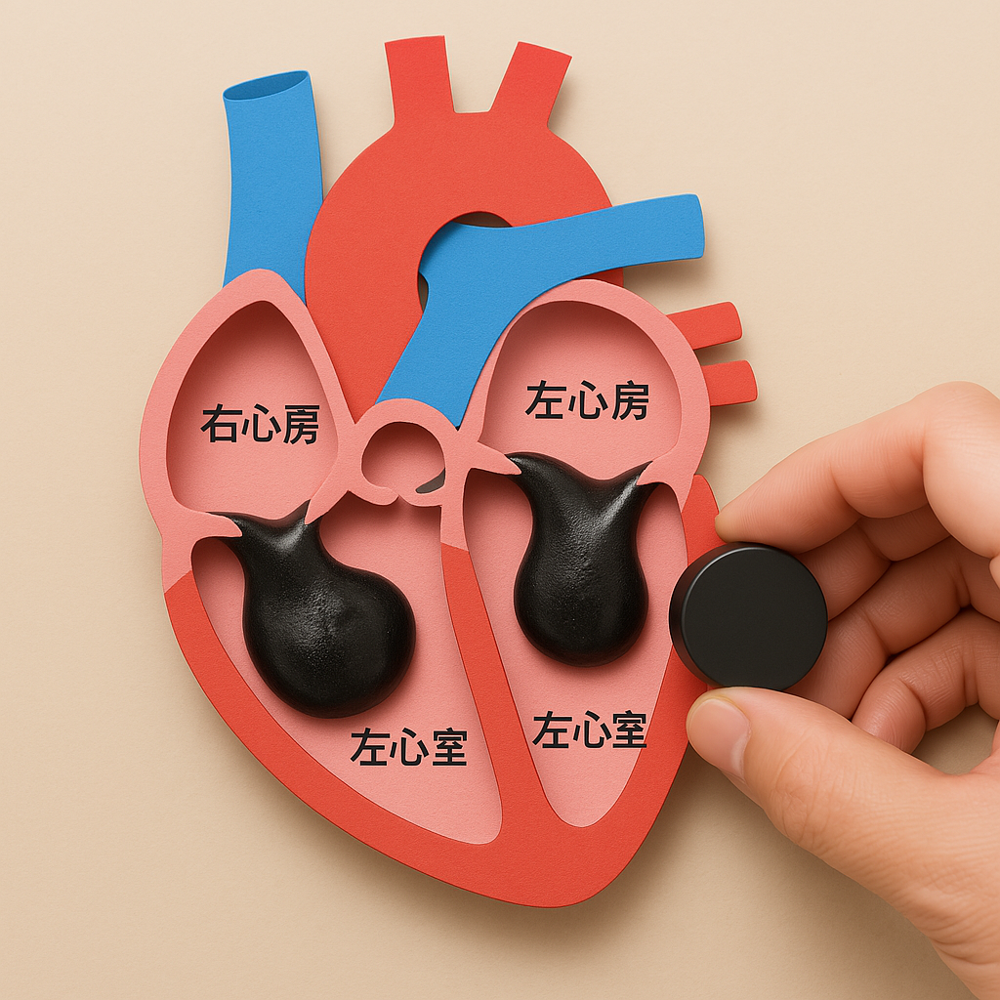

# 心臓ってどうんな臓器

## 1. 🫀心臓ってどんなはたらきをしてるの？

- 心臓は「血液ポンプ」！
水を送るポンプのように、血液を体じゅうに送っているよ。
- だいたい握りこぶしくらいの大きさで、胸のまんなか、ちょっと左にあるんだ。

## 2. 💨心臓が送っている「血液」って何？

- 血液には、酸素や栄養をのせて体のすみずみまで運ぶ役目があるよ。
- いらなくなった二酸化炭素やゴミも集めて、また体の外に出す準備をするんだ。

## 3. ❤️心臓はどうやって動いているの？

- 心臓の中は「右心房」「右心室」「左心房」「左心室」の4つのお部屋に分かれてるよ。
- 「ドクンッ」と動くたびに、血液がそれぞれのお部屋を通って、体の中をぐるぐる回っていくんだ！

## 4. 心臓の４つのお部屋

### 心臓には４つの「お部屋（部屋＝部）」があるよ！

| 部分の名前 | なにをする？ | どこにある？ |
| --------- | ----------- | ---------- |
| 右心房（うしんぼう） | 体から戻ってきた血液を受け取る部屋 | 右上 | 
| 右心室（うしんしつ） | 血液を肺に送るポンプの部屋 | 右下 | 
| 左心房（さしんぼう） | 肺から戻った酸素たっぷり血液を受け取る部屋 | 左上 | 
| 左心室（さしんしつ） | 血液を体じゅうに送るいちばん力持ちの部屋 | 左下 | 

### ⚙️どこがどう動いてる？（動きの順番）

心臓は交代で「収縮（ぎゅっ）」と「拡張（パッ）」をくり返してるんだ。

- 右心房が「パッ」と広がって血液を受け取る
- すぐに右心室が「ぎゅっ」と縮んで、血液を肺へポンプ！
- 肺で酸素をもらった血液が左心房に入ってくる（パッ）
- そして左心室が「ぎゅーっ！！」と力強く縮んで、全身へジャーッ！

この４ステップが「ドクンッ！」って心臓が動くたびに続いてるんだよ。

### 🎨イメージでたとえると…

心臓は「４つの部屋があるトンネルの駅」みたい！

- 血液という電車がそれぞれの駅に停まり
- ポンプ（＝改札係）が「進んで！」とドアを開けたり閉めたりする感じ！

## 5. 表現方法

### 🧲🫀アイデア①：心室の「ぎゅっ・パッ」をスライムで表現！

#### 材料

- 砂鉄を混ぜたスライム（黒っぽくて磁力で動く！）
- 強めの磁石（ネオジム磁石など）
- 心臓の部屋の模型（紙やプラスチック容器など）
しかけ
- 心臓の「右心室」「左心室」にスライムを入れておく
- 磁石を近づけると、スライムがぎゅーーっと吸い寄せられる！→収縮（ぎゅっ）
- 離すとスライムがゆるんで広がる → 拡張（パッ）
→これでポンプみたいな動きが見えるようになる！

